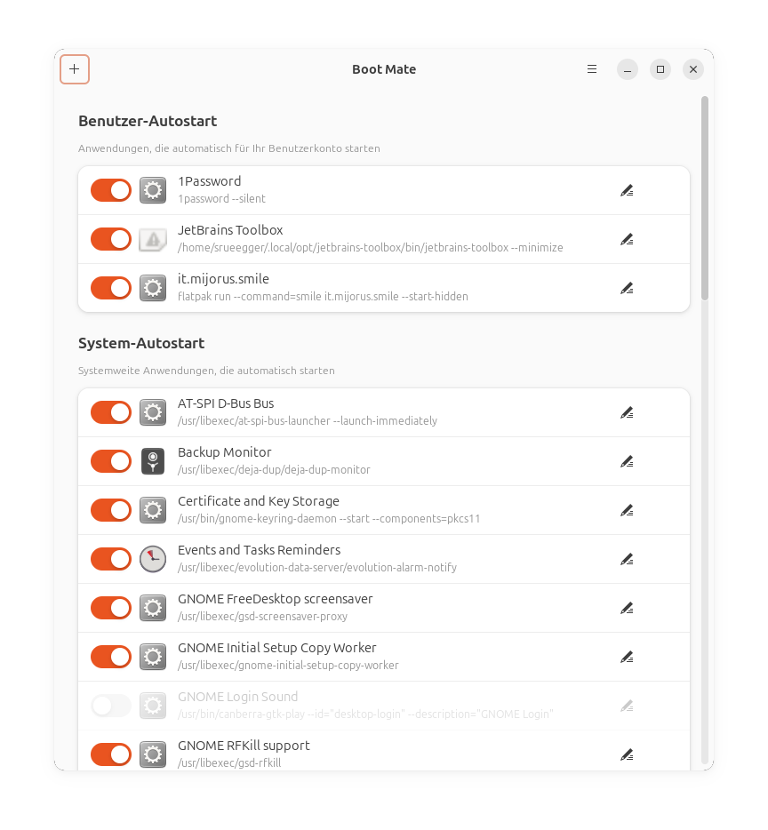
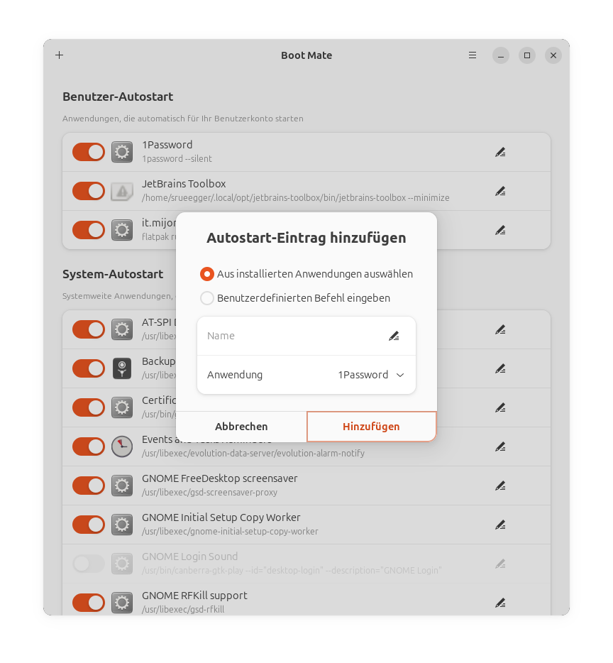
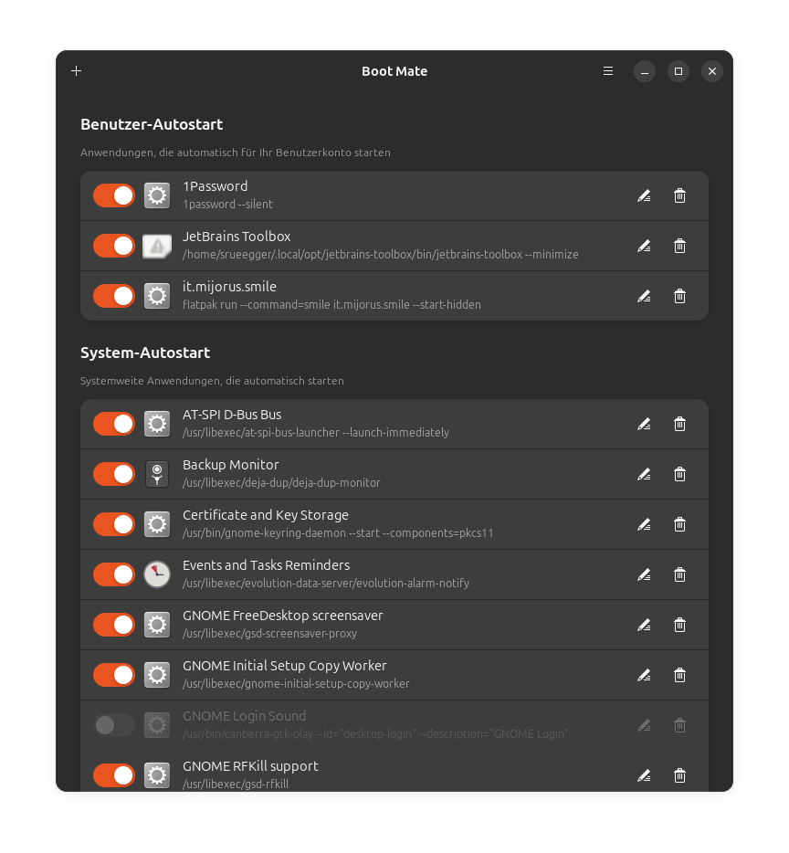
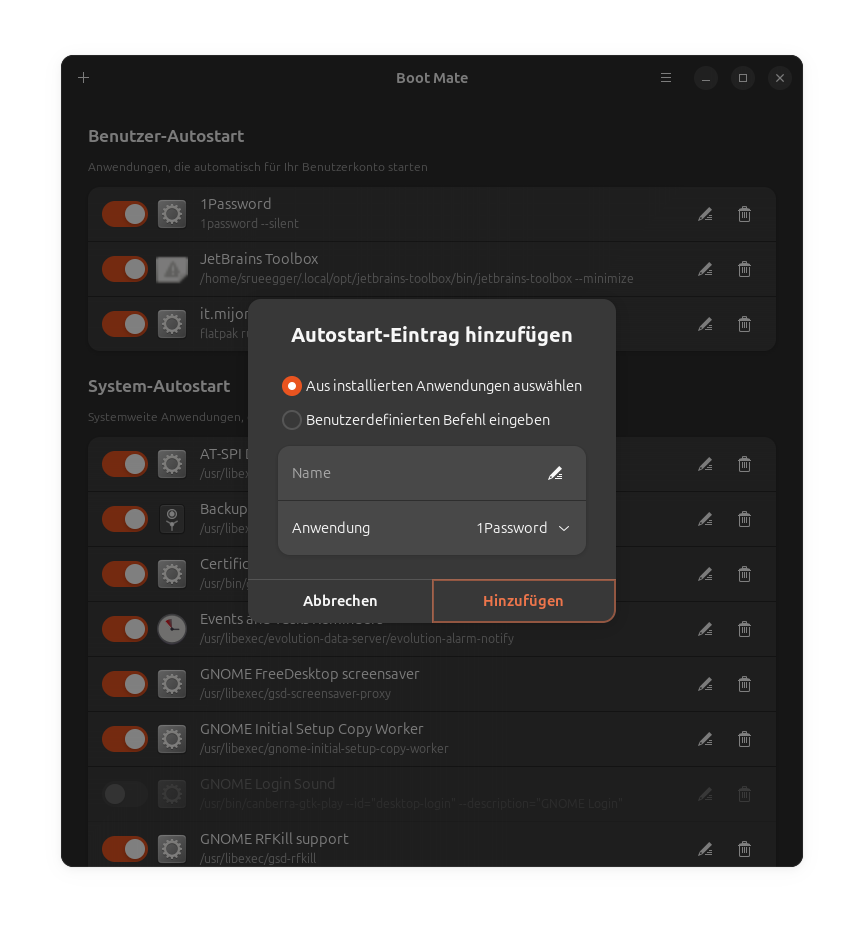

# Boot Mate

A modern GNOME application for managing autostart entries, built with Rust and libadwaita.

## Features

- 📋 View all autostart entries from user and system directories
- ✏️ Edit autostart entry commands and parameters
- 🗑️ Delete or disable autostart entries
- 🌍 Multi-language support (English and German)
- 🎨 Follows GNOME Human Interface Guidelines
- ⚡ Fast and lightweight, built with Rust

## Screenshots

### Light Mode

*Main window showing autostart entries in light mode*


*Adding a new autostart entry in light mode*

### Dark Mode

*Main window showing autostart entries in dark mode*


*Adding a new autostart entry in dark mode*

## Installation

### Snap Store (Recommended)

Install Boot Mate from the Snap Store:

```bash
sudo snap install bootmate
```

The snap package includes all dependencies and works on all major Linux distributions.

### Download Pre-built Packages

Pre-built packages are automatically created for each release:

- **Snap Package**: Download from [GitHub Releases](https://github.com/srueegger/bootmate/releases)
- **DEB Package**: Download from [GitHub Releases](https://github.com/srueegger/bootmate/releases)

```bash
# Install snap package
sudo snap install --dangerous bootmate_1.0.0_amd64.snap

# Install deb package (Ubuntu/Debian)
sudo dpkg -i bootmate_1.0.0_amd64.deb
sudo apt-get install -f  # Install dependencies if needed
```

### From Source

If you prefer to build from source, see the [Building](#building) section below.

## Requirements

### Runtime Dependencies

- GTK 4.10 or later
- libadwaita 1.4 or later (1.8+ recommended for Ubuntu 25.10)
- GLib 2.66 or later

### Build Dependencies

- Rust 1.70 or later
- Meson 0.59 or later
- Cargo
- glib-compile-resources
- glib-compile-schemas
- gettext

### Ubuntu 25.10

On Ubuntu 25.10, you can install all dependencies with:

```bash
sudo apt install build-essential meson cargo rustc \
    libgtk-4-dev libadwaita-1-dev libglib2.0-dev \
    gettext appstream-util desktop-file-utils
```

## Building

### Using Meson (Recommended)

```bash
# Configure the build
meson setup build --prefix=/usr/local

# Build the application
meson compile -C build

# Install (optional)
sudo meson install -C build
```

### Development Build

For development with debug symbols:

```bash
meson setup build -Dprofile=debug
meson compile -C build
```

### Release Build

For optimized release build:

```bash
meson setup build -Dprofile=release
meson compile -C build
```

## Running

After installation:

```bash
bootmate
```

Or from the build directory without installing:

```bash
./build/src/bootmate
```

Or launch from your application menu: **Boot Mate**

## Building a Snap

To build a snap package for local testing or distribution:

```bash
# Install snapcraft
sudo snap install snapcraft --classic

# Build the snap
# Note: Use --destructive-mode if you encounter LXD network issues
snapcraft pack --destructive-mode

# Install the locally built snap
sudo snap install --dangerous bootmate_1.0.0_amd64.snap
```

**Note:** The `--destructive-mode` flag builds directly on your host system instead of using an LXD container. This is useful if you encounter network issues with LXD managed instances.

For publishing to the Snap Store, see [Publishing](#publishing-to-snap-store).

## Project Structure

```
bootmate/
├── data/                   # Application data files
│   ├── icons/             # Application icons
│   ├── ui/                # GTK UI templates
│   ├── *.desktop.in       # Desktop entry file
│   └── *.metainfo.xml.in  # AppStream metadata
├── po/                     # Translations
│   ├── de.po              # German translation
│   └── en.po              # English translation
├── src/                    # Rust source code
│   ├── main.rs            # Application entry point
│   ├── application.rs     # Application logic
│   ├── window.rs          # Main window
│   ├── autostart.rs       # Autostart entry management
│   └── entry_row.rs       # List row widget
├── build.rs               # Build script
├── Cargo.toml             # Rust dependencies
├── meson.build            # Meson build configuration
└── LICENSE                # GPLv2 license

```

## Publishing to Snap Store

To publish Boot Mate to the Snap Store:

1. **Register the snap name** (first time only):
   ```bash
   snapcraft login
   snapcraft register bootmate
   ```

2. **Build the snap**:
   ```bash
   snapcraft
   ```

3. **Upload to the store**:
   ```bash
   snapcraft upload bootmate_1.0.0_amd64.snap
   ```

4. **Release to a channel**:
   ```bash
   # Release to stable channel
   snapcraft release bootmate <revision> stable

   # Or release to edge for testing
   snapcraft release bootmate <revision> edge
   ```

For more information, see the [Snapcraft documentation](https://snapcraft.io/docs/releasing-your-app).

## How It Works

Boot Mate scans the following directories for `.desktop` files:

- `~/.config/autostart/` - User autostart entries (takes precedence)
- `/etc/xdg/autostart/` - System-wide autostart entries
- `/usr/share/gnome/autostart/` - GNOME autostart entries

### Editing Entries

When you edit a system-wide autostart entry, Boot Mate creates a user-specific copy in `~/.config/autostart/` with your changes. This ensures system files remain untouched.

### Deleting Entries

- **User entries**: Deleted directly from `~/.config/autostart/`
- **System entries**: A hidden override is created in `~/.config/autostart/` to disable the entry

## Contributing

Contributions are welcome! Please feel free to submit issues and pull requests.

### Development Guidelines

- All code must be in English (comments, function names, variables)
- Follow Rust best practices and idioms
- Maintain GNOME HIG compliance
- Add translations for new user-facing strings

## License

This project is licensed under the GNU General Public License v2.0 only (GPL-2.0-only).

See [LICENSE](LICENSE) for the full license text.

## Author

**Samuel Rüegger**

- GitHub: [@srueegger](https://github.com/srueegger)
- Repository: [bootmate](https://github.com/srueegger/bootmate)

## Acknowledgments

- Built with [GTK 4](https://gtk.org/) and [libadwaita](https://gnome.pages.gitlab.gnome.org/libadwaita/)
- Rust bindings by [gtk-rs](https://gtk-rs.org/)
- Inspired by the need for autostart management in Ubuntu 25.10+
