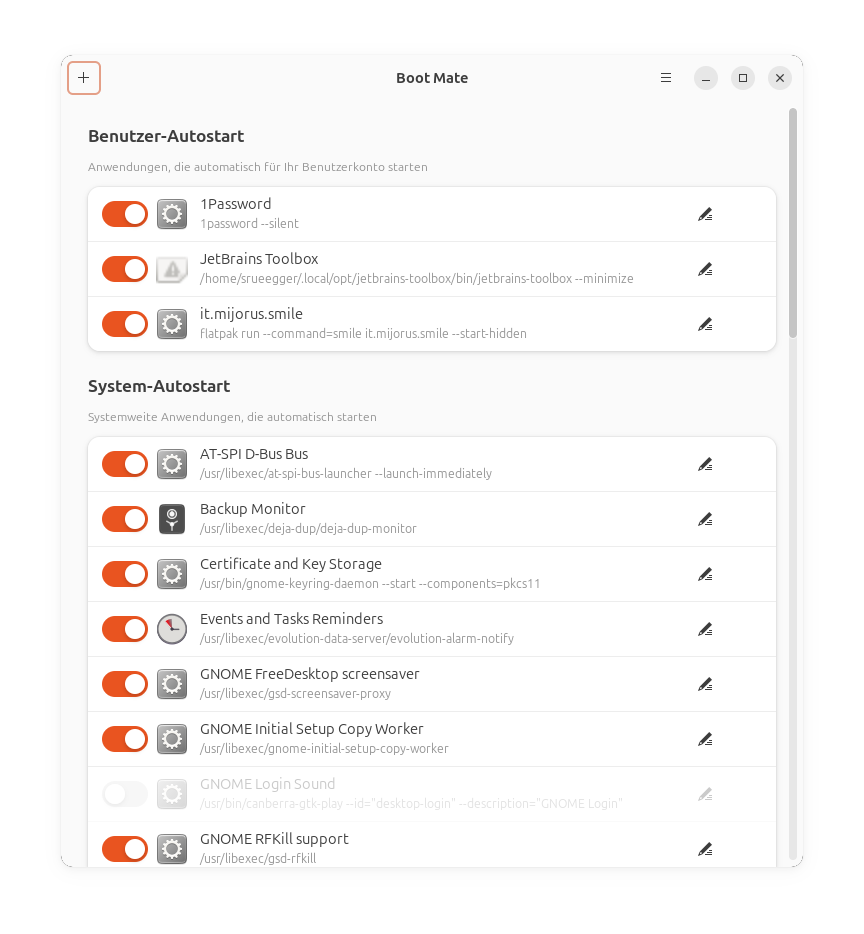
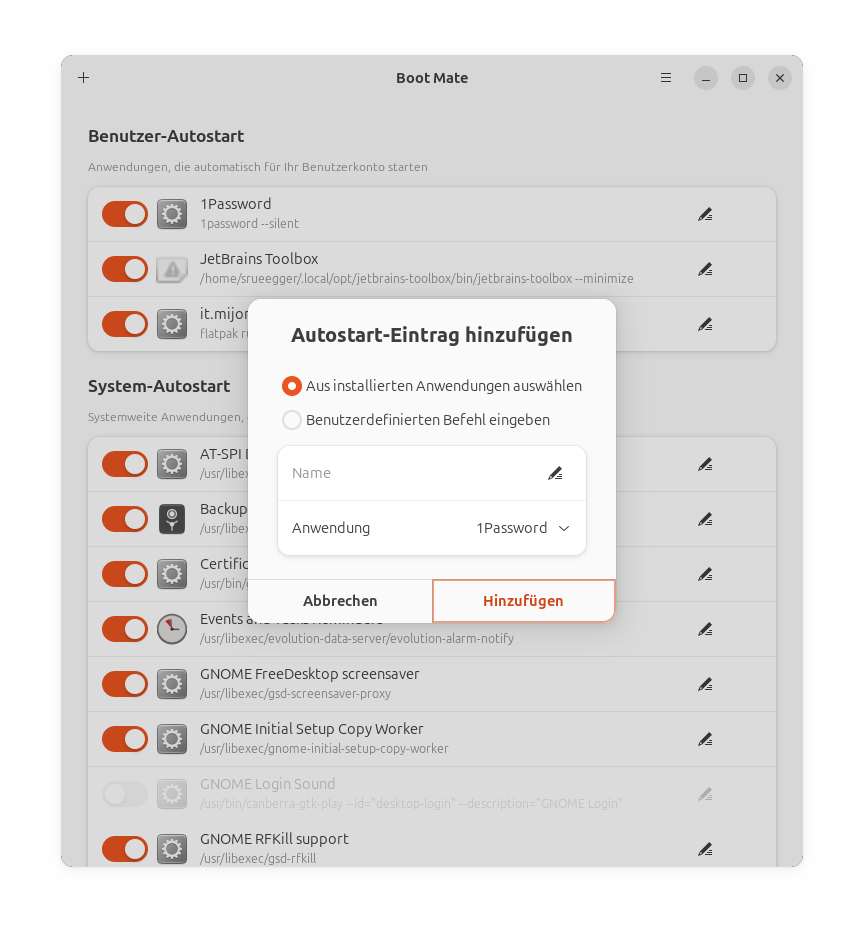
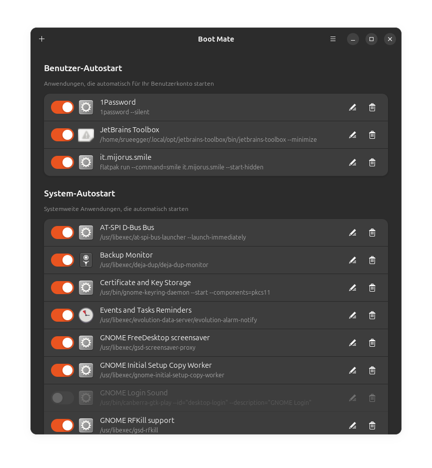
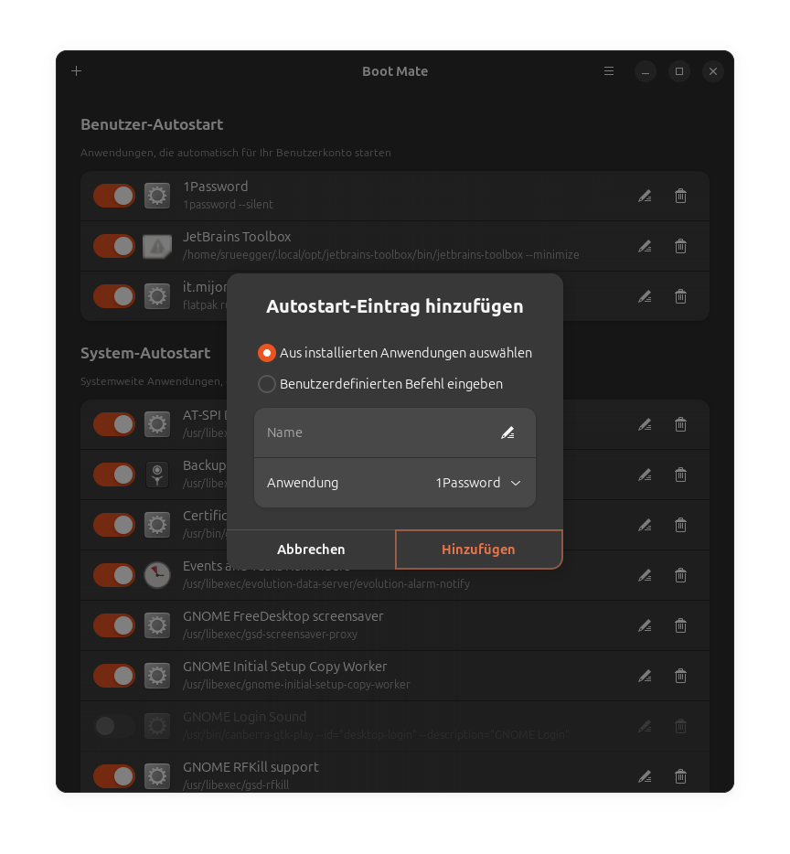

# Boot Mate

A modern GNOME application for managing autostart entries, built with Rust and libadwaita.

## Features

- View all autostart entries from user and system directories
- Edit autostart entry commands and parameters
- Delete or disable autostart entries
- Multi-language support (English and German)
- Follows GNOME Human Interface Guidelines
- Fast and lightweight, built with Rust

## Screenshots

### Light Mode
<table>
  <tr>
    <td width="50%">
      
      <p align="center"><i>Main window showing autostart entries</i></p>
    </td>
    <td width="50%">
      
      <p align="center"><i>Adding a new autostart entry</i></p>
    </td>
  </tr>
</table>

### Dark Mode
<table>
  <tr>
    <td width="50%">
      
      <p align="center"><i>Main window showing autostart entries</i></p>
    </td>
    <td width="50%">
      
      <p align="center"><i>Adding a new autostart entry</i></p>
    </td>
  </tr>
</table>

## Installation

### Flatpak (Recommended)

Install Boot Mate from the rueegger-dev Flatpak repository:

```bash
flatpak remote-add --if-not-exists rueegger-dev https://flatpak.rueegger.dev/rueegger-dev.flatpakrepo
flatpak install rueegger-dev me.rueegger.bootmate
```

Or install directly via the flatpakref file:

```bash
flatpak install https://flatpak.rueegger.dev/me.rueegger.bootmate.flatpakref
```

### From Source

If you prefer to build from source, see the [Building](#building) section below.

## Requirements

### Runtime Dependencies

- GTK 4.22.1 or later
- libadwaita 1.9.0 or later
- GLib 2.66 or later

### Build Dependencies

All build dependencies are provisioned inside a dedicated [Distrobox](https://distrobox.it/) container
named `bootmate-devsystem` (Fedora 44 with GNOME 50 / libadwaita 1.9). The host only needs Distrobox
and a container runtime (Podman or Docker).

## Building

The repository ships helper scripts that execute every build step inside the container,
so the host stays untouched.

### One-time setup

```bash
scripts/devbox-setup.sh
```

This creates the `bootmate-devsystem` container from
[.distrobox/bootmate-devsystem.ini](.distrobox/bootmate-devsystem.ini), runs a full
`dnf upgrade --refresh`, and installs the Meson + Rust + flatpak-builder toolchain inside it.

To refresh packages later:

```bash
scripts/devbox-update.sh
```

### Development build

```bash
scripts/devbox-build.sh             # debug build in ./build
scripts/devbox-run.sh               # run ./build/src/bootmate
```

### Release build

```bash
scripts/devbox-build.sh release     # release build in ./build-release
```

### Local Flatpak test build

```bash
scripts/devbox-flatpak.sh
```

All flatpak-builder state (state dir, OSTree repo, user installation) lives under
`/var/cache/bootmate-flatpak/` **inside the container** — the host `$HOME` is never polluted.

### Interactive shell

```bash
scripts/devbox-enter.sh
```

## Running

After installation:

```bash
bootmate
```

Or from the build directory without installing:

```bash
./build/src/bootmate
```

Or launch from your application menu: **Boot Mate**

## Project Structure

```
bootmate/
├── data/                   # Application data files
│   ├── icons/             # Application icons
│   ├── ui/                # GTK UI templates
│   ├── *.desktop.in       # Desktop entry file
│   └── *.metainfo.xml.in  # AppStream metadata
├── po/                     # Translations
│   ├── de.po              # German translation
│   └── en.po              # English translation
├── src/                    # Rust source code
│   ├── main.rs            # Application entry point
│   ├── application.rs     # Application logic
│   ├── window.rs          # Main window
│   ├── autostart.rs       # Autostart entry management
│   └── entry_row.rs       # List row widget
├── build.rs               # Build script
├── Cargo.toml             # Rust dependencies
├── meson.build            # Meson build configuration
└── LICENSE                # GPLv2 license

```

## How It Works

Boot Mate scans the following directories for `.desktop` files:

- `~/.config/autostart/` - User autostart entries (takes precedence)
- `/etc/xdg/autostart/` - System-wide autostart entries
- `/usr/share/gnome/autostart/` - GNOME autostart entries

### Editing Entries

When you edit a system-wide autostart entry, Boot Mate creates a user-specific copy in `~/.config/autostart/` with your changes. This ensures system files remain untouched.

### Deleting Entries

- **User entries**: Deleted directly from `~/.config/autostart/`
- **System entries**: A hidden override is created in `~/.config/autostart/` to disable the entry

## Contributing

Contributions are welcome! Please feel free to submit issues and pull requests.

### Development Guidelines

- All code must be in English (comments, function names, variables)
- Follow Rust best practices and idioms
- Maintain GNOME HIG compliance
- Add translations for new user-facing strings

## License

This project is licensed under the GNU General Public License v2.0 only (GPL-2.0-only).

See [LICENSE](LICENSE) for the full license text.

## Author

**Samuel Rüegger**

- GitHub: [@srueegger](https://github.com/srueegger)
- Repository: [bootmate](https://github.com/srueegger/bootmate)

## Contributors

- **Actionschnitzel** ([@actionschnitzel](https://github.com/actionschnitzel)) - ARM64 build support

## Acknowledgments

- Built with [GTK 4](https://gtk.org/) and [libadwaita](https://gnome.pages.gitlab.gnome.org/libadwaita/)
- Rust bindings by [gtk-rs](https://gtk-rs.org/)
- Designed for modern GNOME desktop environments
